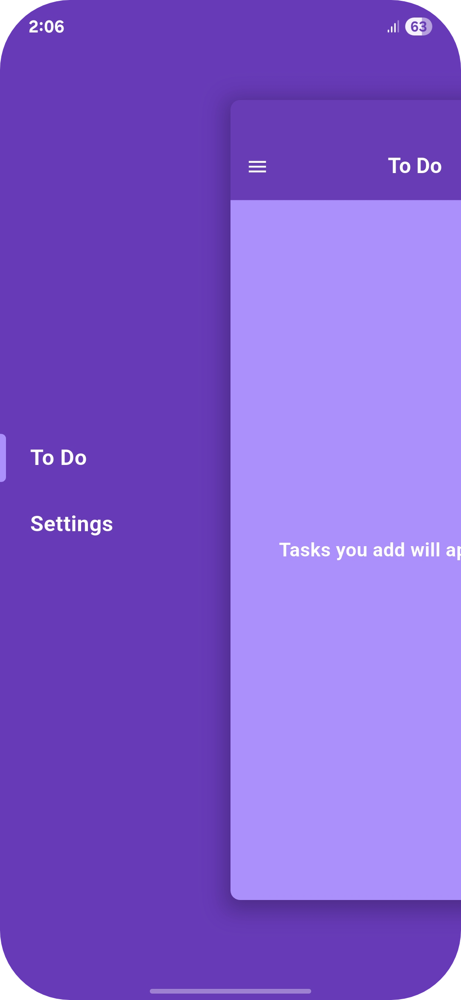
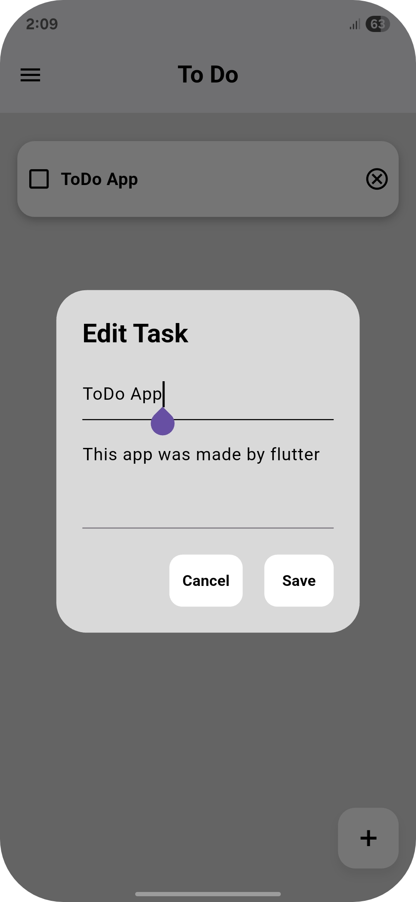
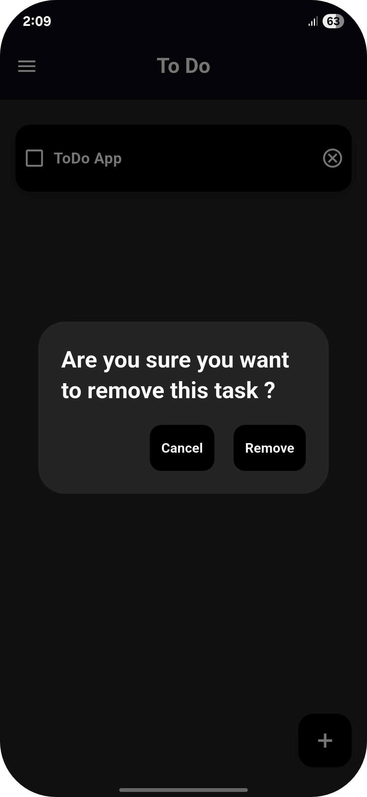

# To-Do List App

A simple and clean to-do list app built with Flutter.

## Features

- **Create tasks** with a title and description
- **Mark tasks as completed** with a checkbox
- **Delete tasks** with a cooldown to prevent accidental removal
- **Persistent storage** using Hive (tasks and settings survive app restarts)
- **Multiple themes** — Light, Dark, and Purple
- **Hidden drawer navigation** between Home and Settings pages

## Screenshots





## Getting Started

1. **Clone the repo**
   ```bash
   git clone <repo-url>
   cd todolist_app
   ```
2. **Install dependencies**
   ```bash
   flutter pub get
   ```
3. **Run the app**
   ```bash
   flutter run
   ```

## Project Structure

```
lib/
├── main.dart              # App entry point, theme definitions
└── pages/
    ├── hidden_drawer.dart # Drawer navigation setup
    ├── home_page.dart     # Task list (add, complete, delete)
    └── settings.dart      # Theme selection
```
